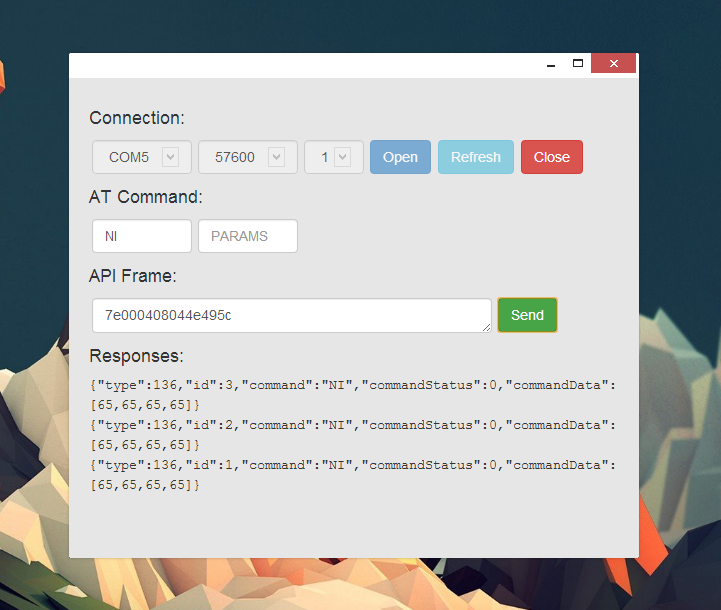

# XBee API Chrome Tool
This is a chrome extension that shows how the [xbee-api](https://github.com/jouz/xbee-api/) module can be used straight from the browser with the [chrome.serial](http://developer.chrome.com/apps/serial.html) API.

It doesn't do much yet, you can connect to a COM port and build AT command frames by changing the AT command name and parameters.

## Building the Module
The module is built to be included in the chrome app using [browserify](https://github.com/substack/node-browserify). To build it yourself, easiest way is to just install the [Grunt](http://gruntjs.com/) requirements and then run ```grunt browserify-example```. The compiled version of [xbee-api](https://github.com/jouz/xbee-api/) is under ```examples/chrome-tool/js/dist/xbee.js```

## Using the Chrome Tool
Open chrome, go to your extensions and enable developer mode. Then ```Load unpacked extension...``` and select this folder (```examples/chrome-tool```). You can launch  and debug it from the extensions page.

